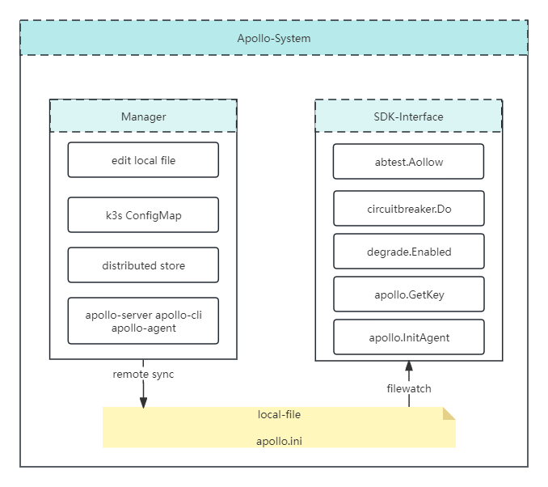

# Apollo(配置中心)

提供各类开关的配置管理，集成便于业务使用的用户侧友好接口，为业务的降级提供便捷的基础能力、及快速落地的抓手。
主要模块包括：配置系统(Apollo)、降级SDK、熔断器、灰度(ABTest)、toolkit(apollo-server apollo-cli apollo-agent)。

## Architecture

主要分两个子模块：配置管理、配置读取（基于 fileWatch 异步更新）。
为解耦业务服务的依赖、引入复杂度，及程序健壮性，设计实现的是本机磁盘缓存 + 分布式存储 + 异步更新 的模型。
1. 业务服务读取基于本地 [ini](https://www.jianshu.com/p/7f60e3ee905b) 文件，通过SDK(监听本地文件变化，实时更新到内存)进行开关配置的取用
2. 配置管理基于分布式存储、或k3s ConfigMap 热更新等方式。管理员可通过修改分布式存储 或 ConfigMap 进行配置更新。

[技术方案设计](./doc/architecture.md)

## Usage

